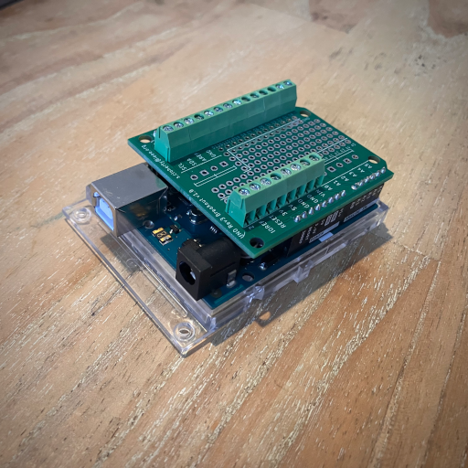

# uno-rev3-breakout-shield

Compact screw terminal breakout/prototyping shield for Arduino UNO Rev3/4.

# Features

* standard Arduino header signals brought out to compact 3.5mm-pitch screw terminals (e.g., Dinkle [ED350V-XXP](https://www.dinkle.com/en/terminalno/ED350V-XXP)).
* 0.1"-pitch prototyping area, inc. 5V and GND rails.
* standard Arduino UNO Rev3/4 shield footprint (no "wings").

    
    

# License
 This work is licensed under a [Creative Commons Attribution-ShareAlike 4.0 International License](http://creativecommons.org/licenses/by-sa/4.0/).

# Dependencies
Custom PCB footprints and device definitions can be found [here](https://github.com/cnuahs/custom-eagle-lbr).